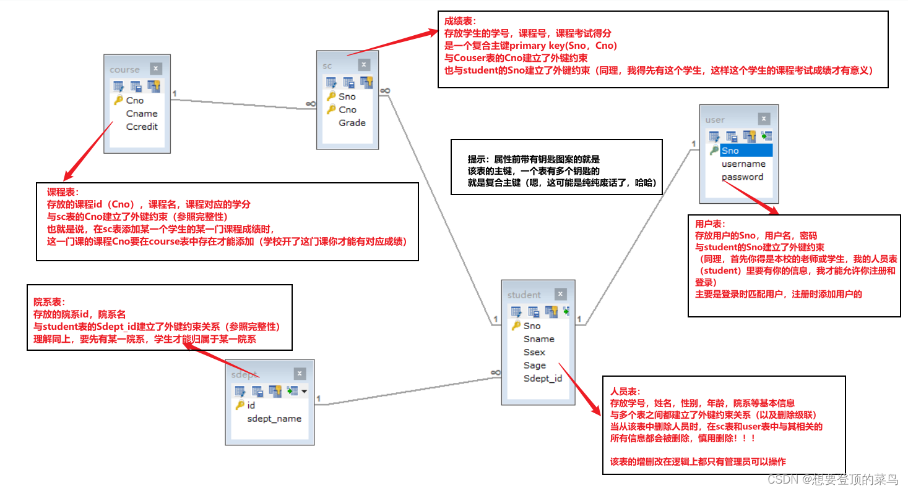

#  									SAMS（Student achievement management system）

表创建：
create database SMS;
-- 学生表
create table student (
	Sno char(11) primary key, -- 学号
	Sname varchar(10) not null, -- 姓名 
	Ssex char(1) check(Ssex='男' or Ssex='女'), -- 性别
	Sage smallint not null, -- 年龄
	Sdept_id int not null, -- 所在系id
	foreign key(Sdept_id) references sdept(id)
);

create table sdept(
	id int primary key auto_increment, -- 主键id
	sdept_name varchar(20) not null -- 系名称
);
-- 课程表
create table course(
	Cno int primary key auto_increment, -- 课程号
	Cname varchar(20) unique not null, -- 课程名称
	Ccredit smallint not null -- 课程学分
	 
);
-- 学生选课表
create table sc(
	id int primary key auto_increment,
	Sno char(11) not null, -- 学号
	Cno int not null, -- 课程号
	Grade int default 0 ,-- 课程分数
	FOREIGN KEY(Sno) REFERENCES student(Sno),
	FOREIGN KEY (Cno) REFERENCES course(Cno)
);

表数据的插入：

INSERT INTO `user` VALUES ('20011010001','管理员','hyl123456'),('20021010410','张美丽','hyl123456'),('20031010301','张晓明','hyl123456');
INSERT INTO `student` VALUES ('20021010203','王老师','女',30,2),('20021010410','张美丽','女',23,6),('20031010209','王小明','男',20,4),('20031010301','张晓明','男',21,3),('20031010302','李晓红','女',20,3),('20031010303','罗志祥','男',19,3);
INSERT INTO `sdept` VALUES (4,'商学院'),(6,'外语学院'),(2,'数学学院'),(3,'机械学院'),(5,'电器学院'),(8,'艺术学院'),(1,'计算机学院'),(7,'飞行学院');
INSERT INTO `course` VALUES (1,'数据库',4),(2,'数学',2),(3,'信息系统',4),(4,'操作系统',3),(5,'数据结构',3),(6,'数据处理',4),(7,'C语言',2),(10,'数字图像',4),(11,'英语',3);

表之间的关系：

界面：都继承自View_Father
View1：初始化登陆界面
View2：注册界面
View3：学生界面
View4：教师界面
View5：管理员界面
View6：修改用户信息
View7：老师添加学生信息界面

View

用到的知识：

//setBackground(Color.yellow); 设置背景颜色
//setForeground(Color.red); 设置字体颜色

